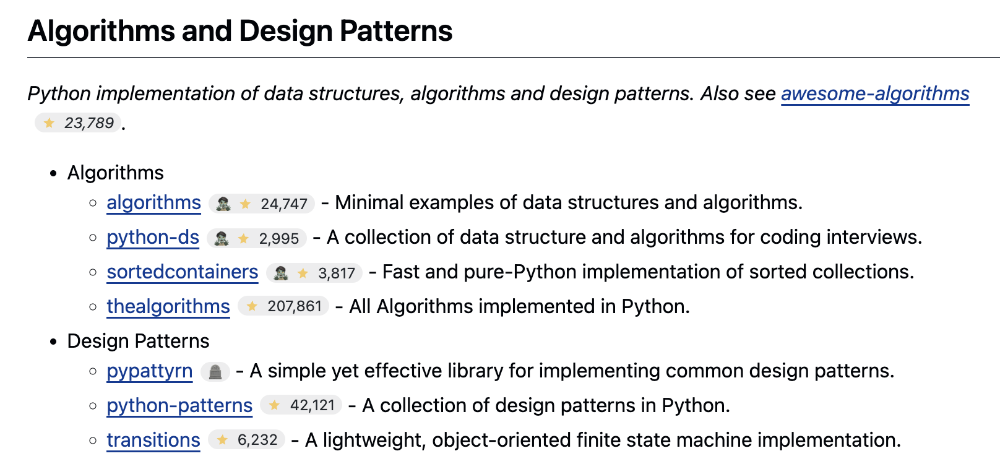

# GitHub Stars Extension
>
> See GitHub repository star counts instantly on any webpage

Never wonder if a GitHub repository is popular again! This Chrome extension automatically shows star counts as badges next to GitHub repository links wherever you browse the web.

## ✨ What it does

When you visit any webpage that mentions GitHub repositories, you'll instantly see how popular each repo is without having to click through to GitHub. Perfect for:

- 📚 Reading documentation with repo links
- 🔍 Browsing awesome lists and curated collections
- 📰 Following tech news and blog posts
- 💼 Evaluating tools and libraries for your projects

## 🚀 Quick Start

### 1. Install the Extension

1. Download or clone this repository
2. Open Chrome and go to `chrome://extensions`
3. Enable "Developer mode" (toggle in top-right)
4. Click "Load unpacked" and select the repository folder
5. Done! The extension is now active

### 2. Add your GitHub Token (Required for practical use)

**Important**: While the extension works without a token, GitHub's API only allows 60 requests per hour for unauthenticated users. You'll quickly hit rate limits with normal browsing.

1. Right-click the extension icon → "Options"
2. Visit [github.com/settings/tokens](https://github.com/settings/tokens) → "Generate new token"
3. Select `public_repo` scope (read access to public repositories)
4. Copy the token and paste it in the extension options
5. Click "Save"

**With a token**: 5,000 requests per hour (enough for heavy browsing)
**Without a token**: 60 requests per hour (you'll see rate limit errors quickly)

### 3. See it in action

Visit any webpage with GitHub links and watch the magic happen! Star counts appear automatically as badges next to repository links.

## 🏷️ What the badges mean

The extension shows different badges based on repository status:

| Badge   | Meaning                                                            | Example                         |
| ------- | ------------------------------------------------------------------ | ------------------------------- |
| ⭐ 1,234 | **Active repository** - Recently updated with development activity | Popular, maintained project     |
| 🧟 ⭐ 856 | **Inactive repository** - No code pushes in 60+ days               | Might be abandoned or complete  |
| 🪦       | **Archived repository** - Officially archived by maintainers       | Read-only, no longer maintained |
| 🚫       | **Repository not found** - Private, deleted, or moved              | Link may be broken              |

*Note: "Inactive" is based on actual code pushes, not general activity like stars or issues.*

## ⚙️ Additional Configuration

Right-click the extension icon and select "Options" to customize:

### GitHub Personal Access Token (Required)

✅ **Already set up?** You configured this in the Quick Start above.

**Token Details:**

- **Purpose**: Access GitHub's API to fetch repository information
- **Scope needed**: `public_repo` (read access to public repositories only)
- **Security**: Stored locally in Chrome's secure storage, never transmitted to third parties
- **Rate limits**: 5,000 API calls per hour (vs. 60 without a token)

### Other Settings

- **Cache duration**: How long to remember star counts (default: 24 hours)
- **Inactive threshold**: Days before marking repos as inactive (default: 60 days)
- **Domain exclusions**: Disable badges on specific websites
- **Toggle badges**: Turn the extension on/off globally

## 🔒 Privacy & Security

- **No data collection**: The extension doesn't track your browsing or send data anywhere
- **Local storage only**: All settings and cached data stay on your device
- **GitHub token security**: Only used for API access, stored securely in Chrome's sync storage, never shared with third parties
- **Open source**: You can review all the code in this repository

## 🐛 Troubleshooting

### Badges not appearing?

- **Most common**: Make sure you've added a GitHub token (see Quick Start step 2)
- Check that the extension is enabled in `chrome://extensions`
- Verify the website isn't in your excluded domains list (Extension Options)
- Make sure the links are actually GitHub repository URLs

### Seeing rate limit errors?

- **You need a GitHub token!** Without one, you only get 60 API requests per hour
- Follow step 2 in the Quick Start guide above to add your token
- With a token, you get 5,000 requests per hour

### Extension not loading?

- Run `npm run build` in the repository folder first
- Make sure you selected the correct folder when loading unpacked
- Check the Chrome extension console for error messages

## 📸 Screenshots



---

## 🛠️ For Developers

*The sections below contain technical information for developers who want to modify, test, or contribute to the extension.*

### Development Setup

This extension uses `esbuild` to bundle the background service worker for Manifest V3 compatibility.

**Prerequisites:**

```bash
npm install
```

**Build the extension:**

```bash
npm run build
```

*This bundles `src/background.js` to `dist/background.js`. Run this before loading the extension if you've modified background script files.*

**Load for development:**

1. Run `npm run build` to create the bundled background script
2. Open Chrome → `chrome://extensions`
3. Enable "Developer mode" (top-right toggle)
4. Click "Load unpacked" → Select the repository root folder
5. The extension loads immediately

### Architecture

This is a **Manifest V3 Chrome extension** with these key components:

- **Content Script** (`src/content.js`): Scans pages for GitHub links, injects badge placeholders
- **Background Service Worker** (`dist/background.js`): Handles GitHub API calls and caching
- **Options Page** (`src/options.html/js`): User configuration interface
- **Modular Library** (`src/lib/`): Reusable modules for URL parsing, caching, API calls

### Testing

**Unit Tests (Jest):**

```bash
npm test
```

**End-to-End Tests (Playwright):**

```bash
# Install Playwright (first time only)
npx playwright install

# Run E2E tests
npm run test:e2e

# View test reports
npx playwright show-report
```

The E2E tests load a test page (`test/test-page.html`) and verify badge injection for different repository states.

### File Structure

```
├── manifest.json           # Extension manifest (MV3)
├── src/
│   ├── content.js          # Content script (badge injection)
│   ├── background.js       # Service worker (API calls)
│   ├── options.html/js     # Configuration interface
│   ├── lib/                # Shared modules
│   └── styles/badge.css    # Badge styling
├── dist/
│   └── background.js       # Bundled service worker
├── test/                   # Unit tests
├── e2e/                    # End-to-end tests
└── icons/                  # Extension icons
```

### Packaging for Distribution

Create a production-ready zip file:

```bash
npm run package
```

This creates `github-stars-extension.zip` containing only the necessary files for Chrome Web Store submission (excludes tests, node_modules, and development files).

### Contributing

1. Fork the repository
2. Create a feature branch
3. Make your changes
4. Run tests: `npm test && npm run test:e2e`
5. Build: `npm run build`
6. Test the extension by loading it unpacked
7. Submit a pull request

### Recent Updates

- **v0.1.0 (Sept 2025)**:
  - Added GitHub token masking in options page for better security
  - Improved inactive repository detection using `pushed_at` timestamps
  - Changed cache TTL from minutes to hours (24-hour default)
  - Made inactive threshold configurable (60 days default)
  - Enhanced badge visual hierarchy with zombie emoji before star icon

### Troubleshooting Development Issues

- **Background script won't load**: Ensure `dist/background.js` exists by running `npm run build`
- **Tests failing**: Run `npm install` to ensure all dev dependencies are installed
- **Extension not updating**: Click the refresh icon for your extension in `chrome://extensions`
- **API rate limits during development**: Add a GitHub token in the extension options

---

*Built with ❤️ using GitHub Copilot and Claude Sonnet*
